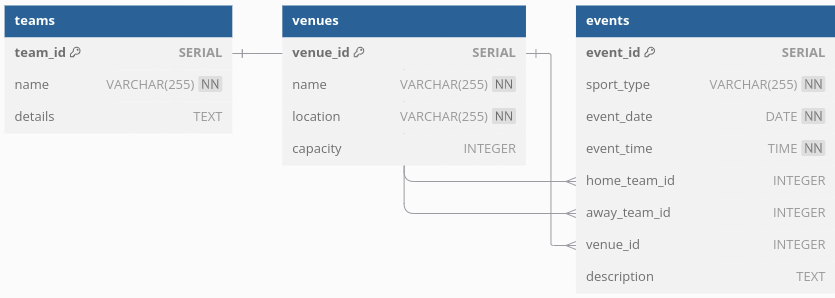

# Sports Event Calendar

## Overview
The Sports Event Calendar is a web application that allows users to manage and display sports events. It provides functionality for adding new events, viewing existing events, and filtering events by sport or date. The application is built using FastAPI for the backend and Jinja2 for templating, with a PostgreSQL database for data storage.

## Features
- Add new sports events with details such as date, time, sport type, teams, venue, and descriptions.
- View a list of all upcoming events.
- Filter events by sport or date.
- User-friendly interface to interact with the application.

## Entity-Relationship Diagram (ERD)


## Database Structure
The application uses the following tables:
- **teams**: Stores information about sports teams.
- **venues**: Contains details about the venues for events.
- **events**: Links the teams and venues while storing event-specific information.

### ERD Structure
- `teams`
  - `team_id`: Auto-incrementing primary key
  - `name`: Team name
  - `details`: Additional information about the team
- `venues`
  - `venue_id`: Auto-incrementing primary key
  - `name`: Venue name
  - `location`: Venue location
  - `capacity`: Venue capacity
- `events`
  - `event_id`: Auto-incrementing primary key
  - `sport_type`: Type of sport
  - `event_date`: Date of the event
  - `event_time`: Time of the event
  - `_home_team_id`: Foreign key referencing `teams.team_id` (Home team)
  - `_away_team_id`: Foreign key referencing `teams.team_id` (Away team)
  - `_venue_id`: Foreign key referencing `venues.venue_id` (Venue)
  - `description`: Event description

## Deployment Instructions

### Prerequisites
- Python 3.7+
- PostgreSQL database
- Virtual environment (recommended)

### Steps to Deploy

1. **Clone the Repository**
   ```bash
   git clone https://github.com/yourusername/sports-event-calendar.git
   cd sports-event-calendar

### Set Up a Virtual Environment

1. **Set Up a Virtual Environment**
   ```bash
   python -m venv venv
   source venv/bin/activate  # On Windows use `venv\Scripts\activate`

### Install Dependencies

```bash
pip install fastapi[all] asyncpg python-dotenv

### Create a .env File
- In the root directory of your project, create a file named `.env`.
- Add the following environment variable to the `.env` file with your PostgreSQL database credentials:
  ```plaintext
  DATABASE_URL=postgresql://<username>:<password>@<hostname>:<port>/<database_name>

### Run the Application
You can run the application using either of the following commands:

```bash
python3 main.py
```

### Access the Application
Open your web browser and go to http://127.0.0.1:8000 to see the application running.

### Entity-Relationship Diagram (ERD)


