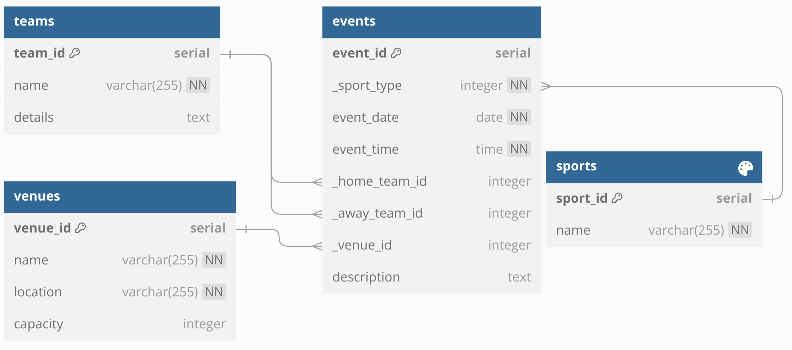

# Sports Event Calendar

## Overview
The Sports Event Calendar is a web application designed for managing and displaying sports events. Built with FastAPI and Jinja2, it utilizes a PostgreSQL database for data storage.

## Demo
Check out the live demo: [Sports Event Calendar Demo](https://coding-exercise-be.vercel.app/)

## Features
- Add sports events with date, time, sport type, teams, venue, and descriptions.
- View all upcoming and past events.
- User-friendly interface.

## Database Structure
The application includes the following tables:
- **teams**: Stores team information.
- **venues**: Contains venue details.
- **sports**: Lists different sports available.
- **events**: Links teams and venues with event-specific data.

### Entity-Relationship Diagram (ERD)


## Deployment Instructions

### Prerequisites
- Python 3.7+
- PostgreSQL
- Virtual environment (recommended)

### Steps to Deploy
1. **Clone the Repository**
   ```bash
   git clone https://github.com/yourusername/sports-event-calendar.git
   cd sports-event-calendar
   ```


### Set Up a Virtual Environment (optional)

- Install Python 3 and venv if needed (Linux example):

```
sudo apt install python3.12-venv```


1. **Set Up a Virtual Environment**
   ```
   python3 -m venv venv
   source venv/bin/activate  # On Windows use venv\Scripts\activate```


### Install Dependencies

```
pip install -r requirements.txt
```

### Create a .env File
- In the root directory of your project, create a file named `.env`.
- Add the following environment variable to the `.env` file with your PostgreSQL database credentials:

  ```
  DATABASE_URL=postgresql://<username>:<password>@<hostname>:<port>/<database_name>?sslmode=require
  ADMIN_PWD=demo123
  ```
  
### Run the Application
You can run the application using either of the following commands:

```
python3 main.py
```

### Access the Application
Open your web browser and go to http://127.0.0.1:8000 to see the application running.


